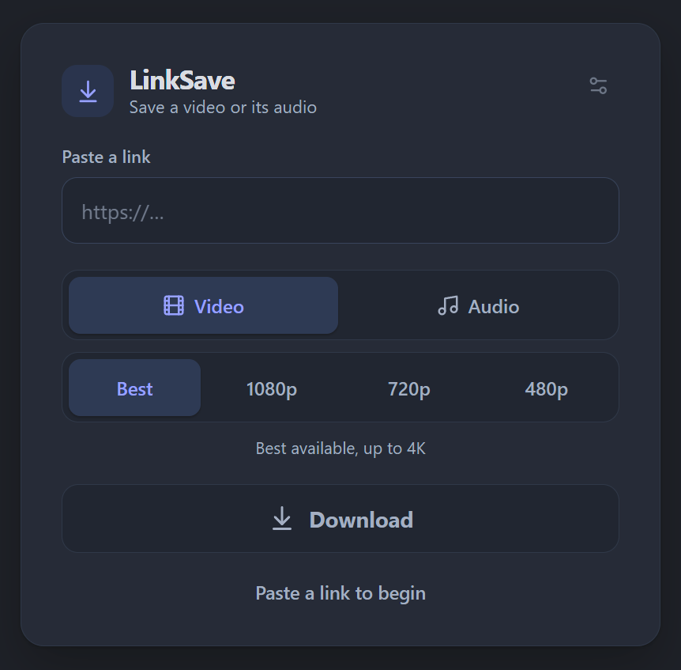
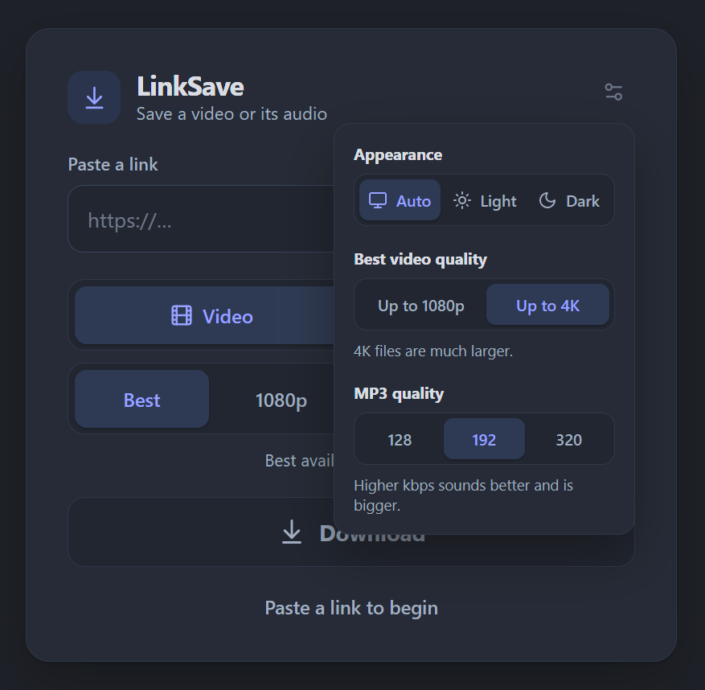

# LinkSave

LinkSave is a small, self-hosted app for downloading public videos or audio from a browser. Paste a link, choose a format and quality, and download the file.

It is made for personal or family use on a home network.

> Only download content you have permission to save. LinkSave does not support private accounts, cookies, DRM-protected media, or CAPTCHA bypassing.

## Screenshots

<p align="center">
  
  
</p>

## Features

- Video and audio downloads powered by [yt-dlp](https://github.com/yt-dlp/yt-dlp)
- MP4, MP3, and M4A output
- Optional 4K downloads
- Link previews before downloading
- Temporary files are removed after download or expiry
- Per-device and global download limits
- yt-dlp keeps itself up to date

## No login: bring your own protection

LinkSave has **no accounts, passwords, or login screen**. Anyone who can reach the port can use it. That is fine on a trusted LAN, but do not expose it to the internet as is.

If you want remote access, put it behind something you already trust, for example:

- a VPN such as WireGuard or Tailscale
- an authenticating reverse proxy (Authelia, Authentik, Caddy or nginx with basic auth)
- Cloudflare Access (LinkSave can optionally verify its login, see below)

## Run with Docker

```bash
git clone https://github.com/fernando-granco/LinkSave.git
cd LinkSave
docker compose up -d --build
```

Open `http://<host-ip>:3017`. Copy `.env.example` to `.env` if you want to change the port, bind address, or limits.

The Compose setup runs the web app, API, download worker, and Redis. Redis is not published on the host.

## Configuration

Common settings are listed below. See [.env.example](.env.example) for every option.

| Variable | Default | Description |
| --- | --- | --- |
| `LINKSAVE_BIND` | `0.0.0.0` | Host address to listen on (use `127.0.0.1` behind a local proxy or tunnel) |
| `LINKSAVE_PORT` | `3017` | Host port |
| `MAX_GLOBAL_CONCURRENT_JOBS` | `2` | Maximum active downloads across all users |
| `MAX_CONCURRENT_JOBS_PER_USER` | `1` | Maximum active downloads per device (client IP) |
| `MAX_VIDEO_DURATION_SECONDS` | `7200` | Longest allowed video |
| `MAX_FILE_SIZE_BYTES` | `2147483648` | Largest allowed file (2 GB) |
| `JOB_EXPIRATION_SECONDS` | `900` | How long completed downloads remain available |
| `ALLOW_4K` | `true` | Show the 4K quality option |
| `YT_DLP_AUTO_UPDATE` | `true` | Update yt-dlp on worker startup and once a day |

## Optional: Cloudflare Access and Tunnel

If you publish LinkSave through Cloudflare, the app can verify the Cloudflare Access login token on every request so nothing bypasses it. Set in `.env`:

```env
LINKSAVE_BIND=127.0.0.1
PUBLIC_BASE_URL=https://download.example.com
REQUIRE_CLOUDFLARE_ACCESS=true
CF_ACCESS_TEAM_DOMAIN=your-team-name
CF_ACCESS_AUD=your-access-application-audience
CLOUDFLARED_TOKEN=your-tunnel-token
```

Then start with the tunnel included:

```bash
docker compose --profile cloudflare up -d --build
```

## Notes

- Playlists are disabled.
- Downloads are processed one at a time per worker.
- Media files are temporary; LinkSave is not a media library.
- URL checks block local and private network addresses, but no self-hosted downloader should be treated as risk-free. Keep the app private and its images up to date.

## Security

See [SECURITY.md](SECURITY.md) for vulnerability reporting.

## License

LinkSave is available under the [MIT License](LICENSE).
